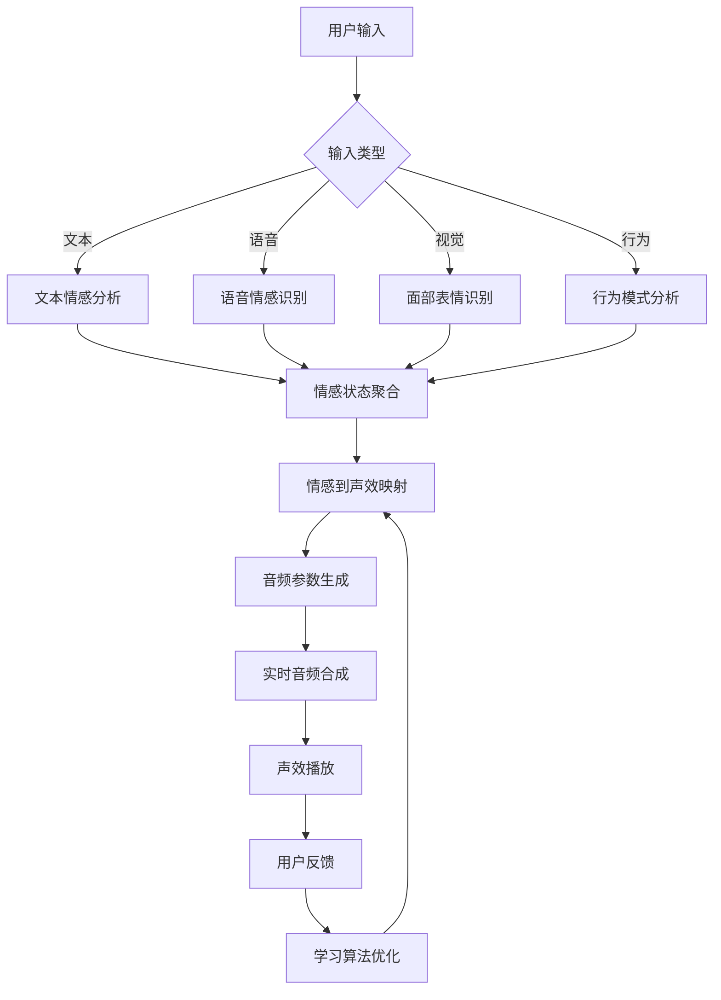

# YYC³ 情感声效交互平台 - 实现指南

本文档详细说明了如何将情感声效交互平台集成到YYC³生态系统中，以及如何扩展和自定义功能。

## 🏗️ 架构集成

### YYC³ 4层架构映射

```plaintext
┌─────────────────────────────────────────────────────────────┐
│                        立方³(Cube)层                        │
│  ┌─────────────────┐  ┌─────────────────┐  ┌───────────────┐ │
│  │   模块管理器     │  │   工作流编排     │  │   系统集成     │ │
│  └─────────────────┘  └─────────────────┘  └───────────────┘ │
├─────────────────────────────────────────────────────────────┤
│                         云(Cloud)层                         │
│  ┌─────────────────┐  ┌─────────────────┐  ┌───────────────┐ │
│  │   AI服务集成     │  │   数据同步      │  │   云端存储     │ │
│  └─────────────────┘  └─────────────────┘  └───────────────┘ │
├─────────────────────────────────────────────────────────────┤
│                         语(Yu)层                           │
│  ┌─────────────────┐  ┌─────────────────┐  ┌───────────────┐ │
│  │   情感分析引擎   │  │   NLP处理       │  │   意图识别     │ │
│  └─────────────────┘  └─────────────────┘  └───────────────┘ │
├─────────────────────────────────────────────────────────────┤
│                         言(Yan)层                          │
│  ┌─────────────────┐  ┌─────────────────┐  ┌───────────────┐ │
│  │  多模态输入捕获  │  │   设备集成      │  │   预处理模块   │ │
│  └─────────────────┘  └─────────────────┘  └───────────────┘ │
└─────────────────────────────────────────────────────────────┘
                                │
                                ▼
                    ┌─────────────────────────────┐
                    │    情感声效交互平台          │
                    │                            │
                    │  ┌─────────┐ ┌───────────┐  │
                    │  │ 声效合成 │ │ 音频播放  │  │
                    │  └─────────┘ └───────────┘  │
                    │                            │
                    │  ┌─────────┐ ┌───────────┐  │
                    │  │ 情感映射 │ │ 可视化    │  │
                    │  └─────────┘ └───────────┘  │
                    └─────────────────────────────┘
```

## 📊 数据流架构

### 输入数据流



### 情感状态数据结构

```typescript
interface YYC3EmotionDataFlow {
  // 输入层数据
  yanInput: {
    textInput?: string;
    audioInput?: AudioBuffer;
    videoInput?: ImageData[];
    behaviorInput?: UserBehaviorData;
  };

  // 分析层数据
  yuAnalysis: {
    emotionScores: Record<YYC3PrimaryEmotion, number>;
    valenceArousal: [number, number];
    confidence: number;
    timestamp: Date;
  };

  // 云层数据
  cloudData: {
    enhancedAnalysis?: AIAnalysisResult;
    historicalData?: EmotionHistory[];
    syncStatus: "synced" | "pending" | "error";
  };

  // 立方³层数据
  cubeOutput: {
    soundParameters: YYC3SoundParameters;
    visualizationData: VisualizationParams;
    systemState: ModuleSystemState;
  };
}
```

## 🎵 音频合成引擎详解

### Web Audio API节点图

```plaintext
                  │
            (主振荡器)
[OscillatorNode] ──┐
                  ├── [GainNode] ── [BiquadFilterNode] ── [ConvolverNode] ── [AudioDestination]
[OscillatorNode] ──┘
                  │
            (泛音振荡器)
```

### 声效参数计算算法

```typescript
class YYC3AdvancedAudioEngine {
  // 基于心理声学的频率映射
  calculateEmotionalFrequency(emotion: YYC3EmotionState): number {
    const baseFreq = 440; // A4

    // Russell环形模型映射
    const angle = Math.atan2(emotion.arousal, emotion.valence);
    const magnitude = Math.sqrt(emotion.valence ** 2 + emotion.arousal ** 2);

    // 频率公式：f = f₀ * 2^(n/12)
    const semitoneShift = (angle / (2 * Math.PI)) * 24; // ±1八度
    const intensityMultiplier = 1 + magnitude * emotion.emotionIntensity * 0.5;

    return baseFreq * Math.pow(2, semitoneShift / 12) * intensityMultiplier;
  }

  // 动态包络生成
  generateAdaptiveEnvelope(emotion: YYC3EmotionState): YYC3SoundEnvelope {
    const intensity = emotion.emotionIntensity;
    const arousal = Math.abs(emotion.arousal);

    // ADSR包络参数计算
    return {
      attack: this.mapRange(arousal, 0, 1, 100, 10), // 高唤醒度 → 快速起音
      decay: this.mapRange(intensity, 0, 1, 200, 50), // 高强度 → 快速衰减
      sustain: 0.3 + (emotion.valence + 1) * 0.35, // 正面情绪 → 高延音
      release: this.mapRange(arousal, 0, 1, 500, 100), // 高唤醒度 → 快速释音
    };
  }

  // 泛音谱生成
  generateHarmonicSpectrum(emotion: YYC3EmotionState): number[] {
    const harmonics = [1.0]; // 基频
    const complexity = Math.abs(emotion.dominance) + emotion.emotionIntensity;

    // 生成泛音系列
    for (let i = 2; i <= Math.floor(4 + complexity * 6); i++) {
      const amplitude = Math.pow(0.7, i - 1) * (0.5 + complexity * 0.5);

      // 情感特定的泛音调制
      let modulation = 1.0;
      switch (emotion.primaryEmotion) {
        case YYC3PrimaryEmotion.JOY:
          modulation = 1.2; // 增强偶次泛音
          break;
        case YYC3PrimaryEmotion.ANGER:
          modulation = i % 2 === 1 ? 1.3 : 0.8; // 强化奇次泛音
          break;
        case YYC3PrimaryEmotion.SADNESS:
          modulation = Math.pow(0.8, i); // 快速衰减
          break;
      }

      harmonics.push(amplitude * modulation);
    }

    return harmonics;
  }

  private mapRange(
    value: number,
    inMin: number,
    inMax: number,
    outMin: number,
    outMax: number,
  ): number {
    return outMin + ((value - inMin) * (outMax - outMin)) / (inMax - inMin);
  }
}
```

## 🧠 机器学习集成

### 用户适应性学习

```typescript
interface YYC3AdaptiveLearningSystem {
  // 用户偏好建模
  userPreferenceModel: {
    preferredFrequencyRange: [number, number];
    preferredAmplitudeRange: [number, number];
    culturalBackground: YYC3CulturalContext;
    personalityProfile: YYC3PersonalityFactors;
  };

  // 反馈学习机制
  feedbackLearning: {
    explicitFeedback: UserRating[];
    implicitFeedback: BehaviorMetrics[];
    learningRate: number;
    decayFactor: number;
  };

  // 模型更新算法
  updateModel(feedback: UserFeedback): void;
  predictOptimalParameters(emotion: YYC3EmotionState): YYC3SoundParameters;
}

class YYC3ReinforcementLearner {
  private qTable: Map<string, Map<string, number>> = new Map();
  private learningRate = 0.1;
  private discountFactor = 0.95;
  private explorationRate = 0.1;

  // Q-Learning算法实现
  updateQValue(
    state: string,
    action: string,
    reward: number,
    nextState: string,
  ): void {
    if (!this.qTable.has(state)) {
      this.qTable.set(state, new Map());
    }

    const stateActions = this.qTable.get(state)!;
    const currentQ = stateActions.get(action) || 0;
    const maxNextQ = Math.max(...(this.qTable.get(nextState)?.values() || [0]));

    const newQ =
      currentQ +
      this.learningRate * (reward + this.discountFactor * maxNextQ - currentQ);
    stateActions.set(action, newQ);
  }

  // 选择最优动作（声效参数）
  selectAction(state: string, availableActions: string[]): string {
    if (Math.random() < this.explorationRate) {
      // 探索：随机选择
      return availableActions[
        Math.floor(Math.random() * availableActions.length)
      ];
    } else {
      // 利用：选择Q值最高的动作
      const stateActions = this.qTable.get(state) || new Map();
      let bestAction = availableActions[0];
      let bestQ = stateActions.get(bestAction) || 0;

      for (const action of availableActions) {
        const q = stateActions.get(action) || 0;
        if (q > bestQ) {
          bestQ = q;
          bestAction = action;
        }
      }

      return bestAction;
    }
  }
}
```

## 🎨 视觉设计系统

### 情感色彩映射

```typescript
class YYC3EmotionalColorSystem {
  // HSL色彩空间映射
  static emotionToHSL(emotion: YYC3EmotionState): [number, number, number] {
    // 色相映射 (Hue: 0-360°)
    const hue = this.mapEmotionToHue(emotion.primaryEmotion, emotion.valence);

    // 饱和度映射 (Saturation: 0-100%)
    const saturation = 30 + Math.abs(emotion.arousal) * 70;

    // 亮度映射 (Lightness: 0-100%)
    const lightness =
      40 + (emotion.valence + 1) * 15 + emotion.emotionIntensity * 20;

    return [hue, saturation, lightness];
  }

  private static mapEmotionToHue(
    emotion: YYC3PrimaryEmotion,
    valence: number,
  ): number {
    const baseHues = {
      [YYC3PrimaryEmotion.JOY]: 60, // 黄色
      [YYC3PrimaryEmotion.SADNESS]: 240, // 蓝色
      [YYC3PrimaryEmotion.ANGER]: 0, // 红色
      [YYC3PrimaryEmotion.FEAR]: 30, // 橙色
      [YYC3PrimaryEmotion.SURPRISE]: 300, // 紫色
      [YYC3PrimaryEmotion.DISGUST]: 120, // 绿色
      [YYC3PrimaryEmotion.NEUTRAL]: 0, // 无色相
    };

    const baseHue = baseHues[emotion] || 0;
    const valenceShift = valence * 30; // ±30°色相偏移

    return (baseHue + valenceShift + 360) % 360;
  }

  // 生成情感主题配色方案
  static generateEmotionalPalette(emotion: YYC3EmotionState): EmotionalPalette {
    const [h, s, l] = this.emotionToHSL(emotion);

    return {
      primary: `hsl(${h}, ${s}%, ${l}%)`,
      secondary: `hsl(${(h + 180) % 360}, ${s * 0.7}%, ${l}%)`,
      accent: `hsl(${(h + 60) % 360}, ${s}%, ${Math.min(l + 20, 90)}%)`,
      background: `hsl(${h}, ${s * 0.3}%, ${Math.max(l - 30, 10)}%)`,
      text: l > 50 ? "#2c3e50" : "#ecf0f1",
    };
  }
}
```

### 动画曲线系统

```typescript
interface YYC3AnimationCurves {
  // 情感驱动的缓动函数
  emotionalEasing: {
    joy: 'cubic-bezier(0.68, -0.55, 0.265, 1.55)',      // 弹跳效果
    sadness: 'cubic-bezier(0.25, 0.46, 0.45, 0.94)',    // 缓慢平滑
    anger: 'cubic-bezier(0.55, 0.055, 0.675, 0.19)',    // 急速开始
    fear: 'cubic-bezier(0.175, 0.885, 0.32, 1.275)',    // 颤抖效果
    surprise: 'cubic-bezier(0.68, -0.55, 0.265, 1.55)', // 突然弹出
    disgust: 'cubic-bezier(0.25, 0.46, 0.45, 0.94)',    // 迟缓反应
    neutral: 'cubic-bezier(0.4, 0, 0.2, 1)'             // 标准缓动
  }

  // 动画持续时间映射
  getDuration(emotion: YYC3EmotionState): number {
    const baseTime = 800 // 基础800ms
    const arousalMultiplier = 1 - Math.abs(emotion.arousal) * 0.5 // 高唤醒度 → 短持续时间
    const intensityMultiplier = 0.7 + emotion.emotionIntensity * 0.6 // 强度影响时长

    return baseTime * arousalMultiplier * intensityMultiplier
  }
}
```

## 🔧 性能优化策略

### 音频处理优化

```typescript
class YYC3AudioOptimizer {
  private audioWorkletNode?: AudioWorkletNode;
  private offlineAudioContext?: OfflineAudioContext;

  // 使用Audio Worklet进行低延迟处理
  async initializeAudioWorklet(): Promise<void> {
    const audioContext = new AudioContext();

    // 加载自定义音频处理器
    await audioContext.audioWorklet.addModule(
      "/audio-processors/emotion-synthesizer.js",
    );

    this.audioWorkletNode = new AudioWorkletNode(
      audioContext,
      "emotion-synthesizer",
    );
    this.audioWorkletNode.connect(audioContext.destination);
  }

  // 预渲染常用声效
  async prerenderCommonSounds(): Promise<Map<string, AudioBuffer>> {
    const commonEmotions = [
      YYC3PrimaryEmotion.JOY,
      YYC3PrimaryEmotion.SADNESS,
      YYC3PrimaryEmotion.ANGER,
      YYC3PrimaryEmotion.NEUTRAL,
    ];

    const prerenderedSounds = new Map<string, AudioBuffer>();

    for (const emotion of commonEmotions) {
      const testEmotion: YYC3EmotionState = {
        primaryEmotion: emotion,
        valence: emotion === YYC3PrimaryEmotion.JOY ? 0.8 : -0.3,
        arousal: 0.5,
        dominance: 0.0,
        emotionIntensity: 0.7,
        confidence: 1.0,
        timestamp: new Date(),
        secondaryEmotions: [],
      };

      const soundParams = this.emotionMapper.mapEmotionToSound(testEmotion);
      const audioBuffer = await this.renderToBuffer(soundParams);

      prerenderedSounds.set(emotion, audioBuffer);
    }

    return prerenderedSounds;
  }

  // 智能资源管理
  private resourcePool = {
    oscillators: new Set<OscillatorNode>(),
    gainNodes: new Set<GainNode>(),
    filters: new Set<BiquadFilterNode>(),
  };

  recycleAudioNodes(nodes: AudioNode[]): void {
    nodes.forEach((node) => {
      if (
        node instanceof OscillatorNode &&
        this.resourcePool.oscillators.size < 10
      ) {
        this.resourcePool.oscillators.add(node);
      } else if (
        node instanceof GainNode &&
        this.resourcePool.gainNodes.size < 10
      ) {
        this.resourcePool.gainNodes.add(node);
      } else if (
        node instanceof BiquadFilterNode &&
        this.resourcePool.filters.size < 10
      ) {
        this.resourcePool.filters.add(node);
      }
    });
  }
}
```

### 渲染优化

```typescript
class YYC3VisualizationOptimizer {
  private canvasPool: HTMLCanvasElement[] = [];
  private renderingQueue: RenderTask[] = [];
  private isRendering = false;

  // 使用Canvas池避免重复创建
  getCanvas(width: number, height: number): HTMLCanvasElement {
    const existingCanvas = this.canvasPool.find(
      (canvas) => canvas.width === width && canvas.height === height,
    );

    if (existingCanvas) {
      return existingCanvas;
    }

    const newCanvas = document.createElement("canvas");
    newCanvas.width = width;
    newCanvas.height = height;

    if (this.canvasPool.length < 5) {
      this.canvasPool.push(newCanvas);
    }

    return newCanvas;
  }

  // 批量渲染队列
  queueRender(task: RenderTask): void {
    this.renderingQueue.push(task);

    if (!this.isRendering) {
      this.processRenderQueue();
    }
  }

  private async processRenderQueue(): Promise<void> {
    this.isRendering = true;

    while (this.renderingQueue.length > 0) {
      const task = this.renderingQueue.shift()!;
      await this.renderTask(task);

      // 让出主线程控制权
      await new Promise((resolve) => setTimeout(resolve, 0));
    }

    this.isRendering = false;
  }

  // 使用OffscreenCanvas进行后台渲染
  async renderOffscreen(emotion: YYC3EmotionState): Promise<ImageBitmap> {
    const offscreenCanvas = new OffscreenCanvas(400, 300);
    const ctx = offscreenCanvas.getContext("2d")!;

    // 渲染情感可视化
    this.drawEmotionVisualization(ctx, emotion, 400, 300);

    return await offscreenCanvas.transferToImageBitmap();
  }
}
```

## 🌍 多语言和文化适应

### 国际化配置

```typescript
interface YYC3CulturalSoundMapping {
  // 不同文化背景的声效偏好
  culturalPreferences: {
    "zh-CN": {
      frequencyPreference: "middle"; // 中频偏好
      volumePreference: "moderate"; // 适中音量
      harmonicComplexity: "simple"; // 简单泛音
      spatialPreference: "centered"; // 居中定位
    };
    "en-US": {
      frequencyPreference: "bright";
      volumePreference: "dynamic";
      harmonicComplexity: "rich";
      spatialPreference: "wide";
    };
    "ja-JP": {
      frequencyPreference: "gentle";
      volumePreference: "subtle";
      harmonicComplexity: "minimal";
      spatialPreference: "intimate";
    };
  };

  // 情感表达文化差异
  emotionExpressionPatterns: {
    "zh-CN": {
      emotionSuppression: 0.3; // 情感抑制程度
      collectivismImpact: 0.7; // 集体主义影响
      hierarchyRespect: 0.8; // 等级观念影响
    };
    "en-US": {
      emotionSuppression: 0.1;
      collectivismImpact: 0.3;
      hierarchyRespect: 0.4;
    };
    "ja-JP": {
      emotionSuppression: 0.6;
      collectivismImpact: 0.9;
      hierarchyRespect: 0.9;
    };
  };
}

class YYC3CulturalAdapter {
  adaptSoundForCulture(
    baseSoundParams: YYC3SoundParameters,
    culture: string,
  ): YYC3SoundParameters {
    const preferences = YYC3CulturalSoundMapping.culturalPreferences[culture];
    if (!preferences) return baseSoundParams;

    const adapted = { ...baseSoundParams };

    // 频率适应
    switch (preferences.frequencyPreference) {
      case "bright":
        adapted.frequency *= 1.2;
        break;
      case "gentle":
        adapted.frequency *= 0.8;
        break;
      case "middle":
      default:
        // 保持原频率
        break;
    }

    // 音量适应
    switch (preferences.volumePreference) {
      case "dynamic":
        adapted.amplitude *= 1.3;
        break;
      case "subtle":
        adapted.amplitude *= 0.7;
        break;
      case "moderate":
      default:
        // 保持原音量
        break;
    }

    // 泛音复杂度适应
    switch (preferences.harmonicComplexity) {
      case "rich":
        adapted.harmonics = this.enhanceHarmonics(adapted.harmonics);
        break;
      case "minimal":
        adapted.harmonics = adapted.harmonics.slice(0, 3);
        break;
      case "simple":
      default:
        // 保持原泛音
        break;
    }

    return adapted;
  }

  private enhanceHarmonics(harmonics: number[]): number[] {
    return harmonics.map((amplitude, index) =>
      index < 6 ? amplitude * 1.2 : amplitude * 0.8,
    );
  }
}
```

## 🧪 测试策略

### 单元测试

```typescript
describe("YYC3EmotionSoundMapper", () => {
  let mapper: YYC3EmotionSoundMapper;

  beforeEach(() => {
    mapper = new YYC3EmotionSoundMapper();
  });

  describe("情感到频率映射", () => {
    it("应该为快乐情绪生成较高频率", () => {
      const joyEmotion: YYC3EmotionState = {
        primaryEmotion: YYC3PrimaryEmotion.JOY,
        valence: 0.8,
        arousal: 0.6,
        dominance: 0.4,
        emotionIntensity: 0.8,
        confidence: 0.9,
        timestamp: new Date(),
        secondaryEmotions: [],
      };

      const soundParams = mapper.mapEmotionToSound(joyEmotion);
      expect(soundParams.frequency).toBeGreaterThan(600);
    });

    it("应该为悲伤情绪生成较低频率", () => {
      const sadnessEmotion: YYC3EmotionState = {
        primaryEmotion: YYC3PrimaryEmotion.SADNESS,
        valence: -0.6,
        arousal: -0.3,
        dominance: -0.2,
        emotionIntensity: 0.6,
        confidence: 0.8,
        timestamp: new Date(),
        secondaryEmotions: [],
      };

      const soundParams = mapper.mapEmotionToSound(sadnessEmotion);
      expect(soundParams.frequency).toBeLessThan(400);
    });
  });

  describe("包络生成", () => {
    it("应该为高唤醒度情绪生成快速包络", () => {
      const highArousalEmotion: YYC3EmotionState = {
        primaryEmotion: YYC3PrimaryEmotion.ANGER,
        valence: -0.7,
        arousal: 0.8,
        dominance: 0.6,
        emotionIntensity: 0.9,
        confidence: 0.85,
        timestamp: new Date(),
        secondaryEmotions: [],
      };

      const soundParams = mapper.mapEmotionToSound(highArousalEmotion);
      expect(soundParams.envelope.attack).toBeLessThan(50);
    });
  });
});
```

### 集成测试

```typescript
describe("YYC3EmotionSoundSystem Integration", () => {
  let provider: YYC3EmotionSoundProvider;
  let audioContext: AudioContext;

  beforeAll(() => {
    // Mock Web Audio API
    global.AudioContext = jest.fn(() => ({
      createOscillator: jest.fn(),
      createGain: jest.fn(),
      createBiquadFilter: jest.fn(),
      destination: {},
      currentTime: 0,
      sampleRate: 44100,
    }));
  });

  it("应该能完整处理情感输入到声效输出流程", async () => {
    const testEmotion: YYC3EmotionState = {
      primaryEmotion: YYC3PrimaryEmotion.JOY,
      valence: 0.8,
      arousal: 0.6,
      dominance: 0.4,
      emotionIntensity: 0.8,
      confidence: 0.9,
      timestamp: new Date(),
      secondaryEmotions: [],
    };

    const soundManager = new YYC3EmotionSoundManager();

    // 验证是否能成功播放声效
    await expect(
      soundManager.playEmotionSound(testEmotion),
    ).resolves.not.toThrow();
  });
});
```

### 性能测试

```typescript
describe("Performance Tests", () => {
  it("声效生成延迟应该小于20ms", async () => {
    const mapper = new YYC3EmotionSoundMapper();
    const synthesizer = new YYC3AudioSynthesizer();

    const testEmotion: YYC3EmotionState = {
      primaryEmotion: YYC3PrimaryEmotion.JOY,
      valence: 0.5,
      arousal: 0.5,
      dominance: 0.0,
      emotionIntensity: 0.7,
      confidence: 0.8,
      timestamp: new Date(),
      secondaryEmotions: [],
    };

    const startTime = performance.now();

    const soundParams = mapper.mapEmotionToSound(testEmotion);
    await synthesizer.synthesizeEmotionSound(testEmotion, soundParams);

    const endTime = performance.now();
    const duration = endTime - startTime;

    expect(duration).toBeLessThan(20);
  });

  it("内存使用应该保持稳定", () => {
    const initialMemory = (performance as any).memory?.usedJSHeapSize || 0;

    // 创建大量声效实例
    const soundManagers = Array.from(
      { length: 100 },
      () => new YYC3EmotionSoundManager(),
    );

    // 清理资源
    soundManagers.forEach((manager) => manager.stopAllSounds());

    // 强制垃圾回收 (如果支持)
    if (global.gc) {
      global.gc();
    }

    const finalMemory = (performance as any).memory?.usedJSHeapSize || 0;
    const memoryIncrease = finalMemory - initialMemory;

    // 内存增长应该小于10MB
    expect(memoryIncrease).toBeLessThan(10 * 1024 * 1024);
  });
});
```

## 📈 监控和分析

### 用户行为分析

```typescript
class YYC3EmotionSoundAnalytics {
  private metricsCollector: MetricsCollector;

  // 收集用户交互数据
  trackEmotionSoundEvent(event: YYC3EmotionSoundEvent): void {
    this.metricsCollector.collect({
      eventType: event.type,
      emotionType: event.emotion.primaryEmotion,
      emotionIntensity: event.emotion.emotionIntensity,
      soundDuration: event.soundParameters.duration,
      userSatisfaction: event.result?.userResponse?.rating,
      timestamp: event.timestamp,
      sessionId: event.context.sessionId,
    });
  }

  // 生成使用报告
  generateUsageReport(timeRange: [Date, Date]): UsageReport {
    const events = this.metricsCollector.query(timeRange);

    return {
      totalEvents: events.length,
      emotionDistribution: this.calculateEmotionDistribution(events),
      averageSatisfaction: this.calculateAverageSatisfaction(events),
      mostActiveTimeRanges: this.identifyActiveTimeRanges(events),
      userEngagement: this.calculateEngagementMetrics(events),
      performanceMetrics: this.analyzePerformanceMetrics(events),
    };
  }

  // 异常检测
  detectAnomalies(events: EmotionSoundEvent[]): Anomaly[] {
    const anomalies: Anomaly[] = [];

    // 检测异常高的错误率
    const errorRate =
      events.filter((e) => e.result?.success === false).length / events.length;
    if (errorRate > 0.05) {
      anomalies.push({
        type: "high_error_rate",
        severity: "high",
        value: errorRate,
        threshold: 0.05,
      });
    }

    // 检测异常低的用户满意度
    const satisfactionEvents = events.filter(
      (e) => e.result?.userResponse?.rating,
    );
    if (satisfactionEvents.length > 0) {
      const avgSatisfaction =
        satisfactionEvents.reduce(
          (sum, e) => sum + (e.result?.userResponse?.rating || 0),
          0,
        ) / satisfactionEvents.length;

      if (avgSatisfaction < 3.0) {
        anomalies.push({
          type: "low_satisfaction",
          severity: "medium",
          value: avgSatisfaction,
          threshold: 3.0,
        });
      }
    }

    return anomalies;
  }
}
```

## 🚀 部署和运维

### Docker容器化

```dockerfile
# Dockerfile
FROM node:18-alpine

WORKDIR /app

# 安装依赖
COPY package*.json ./
RUN npm ci --only=production

# 复制源代码
COPY . .

# 构建应用
RUN npm run build

# 暴露端口
EXPOSE 3000

# 健康检查
HEALTHCHECK --interval=30s --timeout=10s --start-period=5s --retries=3 \
  CMD curl -f http://localhost:3000/health || exit 1

# 启动应用
CMD ["npm", "start"]
```

### Kubernetes部署

```yaml
# k8s-deployment.yaml
apiVersion: apps/v1
kind: Deployment
metadata:
  name: yyc3-emotion-sound-platform
  labels:
    app: emotion-sound
    version: v1.0.0
spec:
  replicas: 3
  selector:
    matchLabels:
      app: emotion-sound
  template:
    metadata:
      labels:
        app: emotion-sound
    spec:
      containers:
        - name: emotion-sound
          image: yyc3/emotion-sound-platform:latest
          ports:
            - containerPort: 3000
          env:
            - name: NODE_ENV
              value: "production"
            - name: AUDIO_WORKLET_ENABLED
              value: "true"
          resources:
            requests:
              memory: "256Mi"
              cpu: "200m"
            limits:
              memory: "512Mi"
              cpu: "500m"
          livenessProbe:
            httpGet:
              path: /health
              port: 3000
            initialDelaySeconds: 30
            periodSeconds: 10
          readinessProbe:
            httpGet:
              path: /ready
              port: 3000
            initialDelaySeconds: 5
            periodSeconds: 5
---
apiVersion: v1
kind: Service
metadata:
  name: emotion-sound-service
spec:
  selector:
    app: emotion-sound
  ports:
    - protocol: TCP
      port: 80
      targetPort: 3000
  type: LoadBalancer
```

### 监控配置

```yaml
# prometheus-config.yml
scrape_configs:
  - job_name: 'yyc3-emotion-sound'
    static_configs:
      - targets: ['emotion-sound-service:80']
    metrics_path: '/metrics'
    scrape_interval: 15s

# grafana-dashboard.json
{
  "dashboard": {
    "title": "YYC³ 情感声效监控面板",
    "panels": [
      {
        "title": "声效生成延迟",
        "type": "graph",
        "targets": [
          {
            "expr": "histogram_quantile(0.95, rate(emotion_sound_synthesis_duration_seconds_bucket[5m]))",
            "legendFormat": "95th percentile"
          }
        ]
      },
      {
        "title": "情感识别准确率",
        "type": "stat",
        "targets": [
          {
            "expr": "rate(emotion_recognition_correct_total[5m]) / rate(emotion_recognition_total[5m])",
            "legendFormat": "准确率"
          }
        ]
      },
      {
        "title": "用户满意度分布",
        "type": "piechart",
        "targets": [
          {
            "expr": "sum by (rating) (rate(user_satisfaction_rating_total[1h]))",
            "legendFormat": "{{ rating }}星"
          }
        ]
      }
    ]
  }
}
```

## 🔮 未来发展方向

### 1. 高级AI集成

- **神经网络音频合成**: 使用GAN或VAE生成更自然的情感声效
- **多模态融合**: 结合视觉、语音、文本的综合情感理解
- **实时情感预测**: 基于历史数据预测情感变化趋势

### 2. 沉浸式体验

- **3D空间音频**: 基于头部追踪的个性化HRTF
- **触觉反馈集成**: 与触觉设备联动提供多感官体验
- **VR/AR支持**: 在虚拟环境中的情感声效交互

### 3. 社交化功能

- **情感共鸣网络**: 用户间的情感状态共享和同步
- **协作式情感创作**: 多用户协同创建情感声效体验
- **情感社区**: 基于情感偏好的用户社区建设

### 4. 企业级特性

- **情感分析API**: 为第三方应用提供情感声效服务
- **定制化解决方案**: 针对特定行业的情感交互优化
- **企业级安全**: 数据加密、隐私保护、合规认证

这个实现指南为YYC³情感声效交互平台提供了完整的技术实现路径，从底层架构到高级功能，从性能优化到部署运维，为开发者提供了全方位的技术参考。
